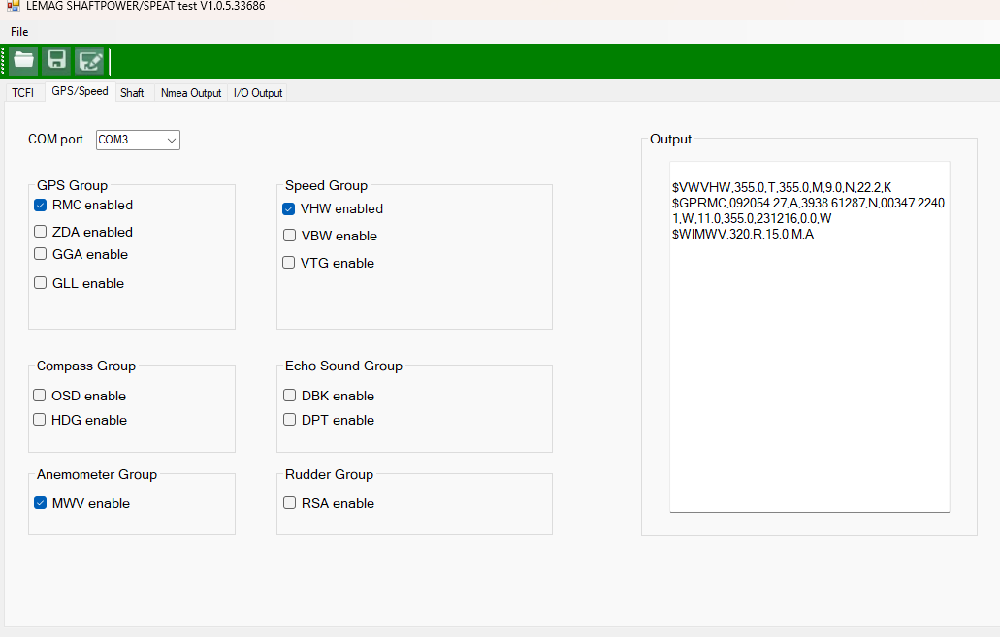
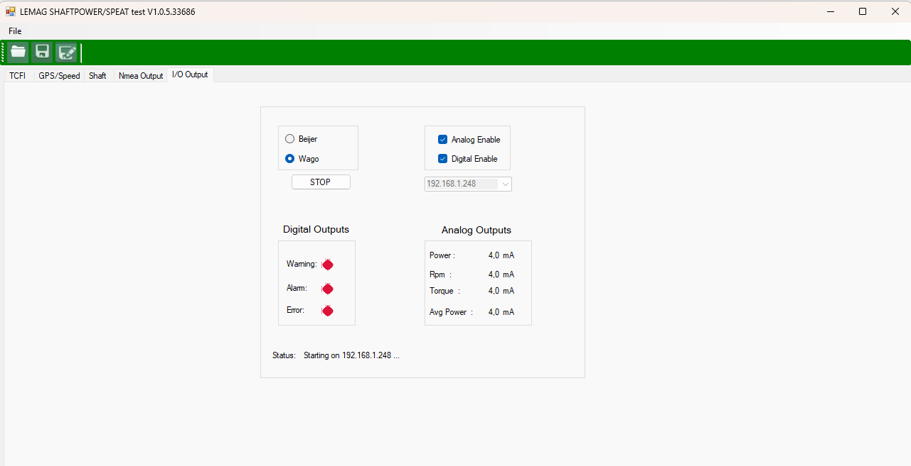

# ⚙️ LEMAG Shaftpower/SPEAT Test Tool

This tool is designed for configuring and testing the LEMAG Shaftpower and SPEAT system. It allows for real-time communication, NMEA data stream configuration, and I/O signal output monitoring.

---

## ✨ Key Features

- 🖥️ **Emulation of Wago and Beijer Devices**
- 📡 **Custom NMEA Sentence Generation**
- 🚨 **Digital Output Simulation**: Warning, Alarm, Error
- 🎛️ **Analog Output Simulation**: RPM, Torque, Power, Avg Power
- 📊 **Real-Time Data Output**
- 🧭 **User-Friendly Interface**: Group selection for GPS, Speed, Compass, etc.

---

## 🛠️ Built With

- 💻 **Language**: C# (.NET Framework 4.8)  
- 🪟 **UI Framework**: Windows Forms  
- 📚 **Third-party Libraries**:
  - DevExpress v21.2  
  - PCAN Light API  
  - Modbus DLL  
- 🧩 **System Dependencies**:
  - `System.Windows.Forms`  
  - `System.IO`  
  - `System.Printing`  
  - `System.Data.Linq`

    ---

    ## 📸 Screenshots

### 🔧 NMEA Signal Configuration  
Configuration panel for enabling and customizing GPS, Speed, Compass, Echo Sounder, Rudder, and Anemometer outputs:

---

### 🔌 I/O Subsystem Emulation  
Digital and analog output simulation interface with Wago/Beijer selection, status display, and live analog values:

